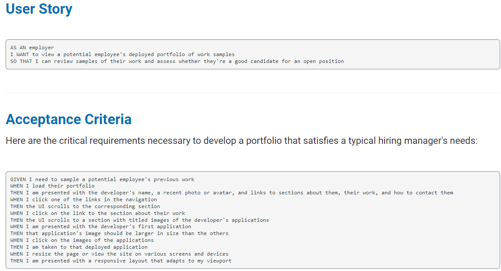

# **Jelena-Rogic.Portfolio**

## Description
This is my personal portfolio created to allow any of my future colleagues, and employers to get to know me better. Certainly, one of the first steps I am making in order to do what I love and that is coding! This website has four sections. One of them  contains a little information about me, in second section you can see my previous projects, third one is where in future you will be able to download my resume and of course last one is with my contact information.

---

## Installation
* Clone the repository  
```
git clone git@github.com:Jelenarog/Jelena-Rogic.Portfolio.git
```

---
## Usage 
Personal portfolio with navigation bar that navigates to sections About me, Contact me, Resume, and my previous work. 
* If you click image of my previous work you will be redirected to that deployed webpage;
* If you select  resume button Jelena Rogic's resume will be downloaded to your device;
* By selecting my contact information you will be taken either to my Linkedin or Github page



 
 ---
 ## Links
 [Github Repository Link](https://github.com/Jelenarog/Jelena-Rogic-portfolio/) <br/>
 [Deployed website](https://jelenarog.github.io/Jelena-Rogic-portfolio/)<br/>
 [HTML code](./assets/Images/Html.code.png)<br/>
 [CSS style sheet](./assets/Images/Css.Image.png)

 ---
## License 
Please refer to the LICENSE in the repo.

---
